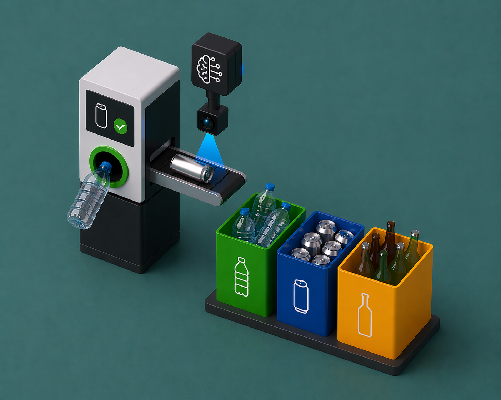
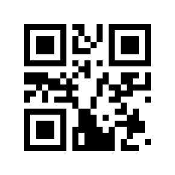

<div align="center">
  
# Reverse Vending Machine (RVM)



<br>

**AI • Computer Vision • Embedded Systems • • • • • **

<br>

*Graduation Project - Electronic and Automatic Systems - State Engineering Diploma*  
*ENSA Tangier · 2022–2023*

</div>

<hr>


# Reverse Vending Machine (RVM) - Waste Classification and Automated Sorting Prototype


This project is a Qt-based recycling and waste-sorting vision mechanism . The main application provides a touchscreen desktop UI is built on a camera for waste classification with a TensorFlow Lite model and controlled GPIO hardware from a raspberry pi that work together to detect an item, classify it, and react through the UI and motors.


RVM is a PyQt5-based GUI application developed for Raspberry Pi. It provides a touchscreen-friendly desktop UI, UI resources (icons and images), and a motor-control module so the application can control attached hardware (motors) from the GUI.

## Stack
- **Language(s):** Python 3
- **Framework / runtime:** PyQt5 (Qt Designer .ui files compiled with pyuic5 / pyrcc5)
- **Notable libraries:** PyQt5, standard Raspberry Pi GPIO libraries (used in motor control code)


## How it's organized (important files)
- developement/raspberry/
  - `main.py` / `raspberry_main.py` — application entrypoints that start the Qt event loop and wire UI to application logic.
  - `ui_pano.ui`, `messagebox.ui` — Qt Designer files (source UI layout).
  - `res_img.qrc` — Qt resource collection (references images/icons used by the UI).
  - `modules/` — generated Python modules from .ui/.qrc and helper modules:
    - `ui_main.py`, `ui_main_2.py` — UI class glue generated from `ui_pano.ui`.
    - `messagebox.py` — generated from `messagebox.ui`.
    - `resources.py` — compiled resources (contains embedded image assets used by the UI).
    - `ui_functions.py`, `app_settings.py` — small helper modules for UI behavior and settings.
  - `motor.py` — motor control / hardware interface (GPIO interaction lives here).
  - `images/` — icons and images used by the UI.


## How it fits together (runtime shape)
1. The application starts in `main.py` or `raspberry_main.py` which create a QApplication and the main window object.
2. Generated UI modules (from `modules/ui_main.py` / `modules/ui_main_2.py`) provide UI classes which the entrypoint imports and instantiates.
3. The UI code imports `modules/resources.py` so icons/images are available via Qt resource paths.
4. When the user interacts with the UI, event handlers call helper functions in `modules/ui_functions.py` or `app_settings.py` and, for hardware actions, call `motor.py` to actuate motors via GPIO.

## UML-like diagram (ASCII)

 +-----------------+        +--------------------+        +------------------+
 |  Qt Main Window | <----> |  UI modules (py)   | <----> | resources.py     |
 |  (main.py)      |        |  ui_main / handlers|        | (images/icons)   |
 +-----------------+        +--------------------+        +------------------+
            |                         |
            |                         V
            |                  +----------------+
            |                  | ui_functions   |
            |                  +----------------+
            V
  +-----------------+
  | motor.py (GPIO) |  <-- hardware interface (Raspberry Pi GPIO, motor drivers)
  +-----------------+


Mermaid-style (also included) — renderable on GitHub if your viewer supports Mermaid:

```mermaid
flowchart LR
  A[main.py / raspberry_main.py] --> B[UI modules (ui_main / ui_main_2)]
  B --> C(resources.py)
  B --> D[ui_functions.py]
  A --> E[motor.py]
  D --> E
  E --> F[Motor hardware / GPIO]
```

## How to build / run (shortest path)
1. Create a virtualenv and install dependencies (from the variant folder):

```bash
python3 -m venv venv
source venv/bin/activate
pip install -r developement/raspberry/requirement.txt
```

2. (Optional) Regenerate Python modules if you edit UI or resource files:

```bash
cd developement/raspberry
pyuic5 -o modules/ui_main.py ui_pano.ui
pyuic5 -o modules/messagebox.py messagebox.ui
pyrcc5 res_img.qrc -o modules/resources.py
```

3. Run the app (from the repo root or the developement/raspberry folder):

```bash
python3 developement/raspberry/main.py
# or
python3 developement/raspberry/raspberry_main.py
```

Notes:
- The `modules/resources.py` file is large because it contains embedded image data. If you change images, regenerate `resources.py` with `pyrcc5`.
- For hardware access on a Raspberry Pi, the process may require running as root or through appropriate GPIO groups.

## Figures (images taken from this repository)
- Project logo:

  

- Example icon (About):

  

- Window control icons:

    

(Images above are stored in the `developement/raspberry/images/icons/` folder.)

## Where to look next / try asking
- Which entrypoint should be used for a touchscreen deployment: `main.py` or `raspberry_main.py`?
- Do you want a line-by-line explanation of `motor.py` to see which GPIO pins and motor driver are used?
- Should I produce a simple block diagram (PNG) combining the ASCII/Mermaid UML and the project logo for use in documentation?

---

If you'd like, I can commit this README now (I've just updated it in the repository), and next I can:
- create a simple PNG diagram combining the ASCII/Mermaid layout and the logo, or
- open `developement/raspberry/main.py` and produce a guided walkthrough of the startup flow and key functions.
