<div align="center">
  
# Reverse Vending Machine (RVM)


<br>

**AI • Computer Vision • Embedded Systems • TensorFlow • OpenCV • Raspberry Pi • PyQt5 • Automation • Mechatronics • IoT**

<br>

*Graduation Project - State Engineering Diploma - Electronic and Automatic Systems*  
*ENSA Tangier · 2022–2023*

</div>

<hr>


# Reverse Vending Machine (RVM) - Automated Sorting Waste Classification Prototype


This project is a Qt-based recycling and waste-sorting vision mechanism . The main application provides a touchscreen desktop UI is built on a camera for waste classification with a TensorFlow Lite model and controlled GPIO hardware from a raspberry pi that work together to detect an item, classify it, and react through the UI and motors.


<hr>

## 1. Project Overview

This project presents an **Edge AI based intelligent Reverse Vending Machine (RVM)** developed to investigate the automated identification, processing, and sorting of recyclable waste using a combination of **computer vision, embedded computing, machine learning, electromechanical control, and Human Machine Interface development**.

The project evolved through **two engineering generations**.

The first generation was a functional prototype centered around a **Raspberry Pi, camera, TensorFlow Lite classifier, GPIO peripherals, touchscreen interface, and mechanical actuation**. This prototype was used to acquire waste images, execute on-device classification, maintain recycling sessions, collect additional machine-specific training samples, and validate the overall RVM concept.

The second generation extended the original concept into a more modular architecture. It introduced a redesigned mechanical and electronic system with **multiple Arduino Nano controllers, ultrasonic sensors, stepper motor drivers, conveyor mechanisms, controlled illumination, thermal printing, and redesigned PyQt5 touchscreen interfaces**. The Raspberry Pi remained the high-level processing unit responsible for computer vision, inference, user interaction, and system-level coordination.

The complete project therefore covers the engineering chain from **dataset preparation and CNN training to TensorFlow Lite deployment, embedded image acquisition, HMI development, sensing, actuation, conveyor design, and automated waste-sorting architecture**.

### Project generations

| Version          | Main objective                                                                                                                                                                                   |
| ---------------- | ------------------------------------------------------------------------------------------------------------------------------------------------------------------------------------------------ |
| **Prototype V1** | Validate camera-based waste classification, Raspberry Pi deployment, user interaction, data acquisition, GPIO control, and the RVM operating concept                                             |
| **Upgraded V2**  | Redesign the prototype into a more modular machine architecture using distributed sensing and actuation, multiple Arduino controllers, improved mechanics, and redesigned touchscreen interfaces |

---

# 2. Prototype Operating Principle

The first prototype was developed around a **Raspberry Pi as the embedded processing platform**.

Its main role was to connect the computer vision pipeline with the physical machine and the user interface.

The operating principle follows a closed interaction between the **user, sensors, vision system, classifier, embedded application, and mechanical subsystem**.

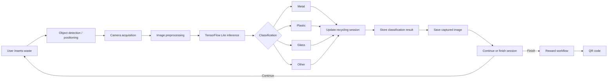

### Main prototype functions

The Raspberry Pi application integrates several functions within the same embedded software stack:

* camera acquisition using **OpenCV**
* image preprocessing before inference
* on-device inference using a **TensorFlow Lite model**
* four-class waste classification
* session and item-count management
* automatic storage of machine-captured images
* Raspberry Pi GPIO interfacing
* motor-control primitives
* touchscreen HMI execution using **PyQt5**
* backend session communication
* encrypted QR-code generation for reward redemption

The prototype repository and trained deployment model are preserved under:

```text
developement/backup_iosen/
```

The deployed TensorFlow Lite model is stored as:

```text
developement/backup_iosen/model/my_modelv2b0.tflite
```

---

# 3. Prototype System Sequence

The following sequence describes the complete software-side operating cycle implemented around the prototype.

### Step 1: Session initialization

The user starts a recycling session through the touchscreen interface.

The Raspberry Pi application initializes the session state and prepares the system for object insertion.

```text
User
  ↓
PyQt5 HMI
  ↓
Session initialization
  ↓
Waiting for waste insertion
```

### Step 2: Object detection

The physical system detects the presence and position of the inserted object through the machine's sensing mechanism.

The prototype code contains GPIO event handling used to react to physical machine states.

```text
Object inserted
  ↓
Sensor / GPIO event
  ↓
Raspberry Pi callback
```

### Step 3: Controlled image acquisition

The Raspberry Pi activates the imaging sequence and acquires a frame from the camera.

Controlled illumination is used in the machine architecture to reduce environmental lighting variation and improve consistency between captured samples.

```python
cap = cv2.VideoCapture(0)

ret, frame = cap.read()

frame = cv2.cvtColor(
    frame,
    cv2.COLOR_BGR2RGB
)
```

### Step 4: Image preprocessing

The captured frame is resized according to the input dimensions expected by the neural network.

Pixel values are normalized before inference.

```python
cv2_im = cv2.resize(
    cv2_im,
    (self.height, self.width)
)

img_array = np.asarray(
    cv2_im * 1.0 / 255,
    dtype="float32"
)
```

### Step 5: Edge inference

The processed image is passed directly to the **TensorFlow Lite interpreter running on the Raspberry Pi**.

```python
self.interpreter.set_tensor(
    self.input_details,
    image
)

self.interpreter.invoke()

predictions = self.interpreter.get_tensor(
    self.output_details
)
```

The predicted class is selected using the maximum output probability:

```python
y_lite = np.argmax(predictions)
```

The deployed classifier uses four output categories:

```python
[
    "Glass",
    "Metal",
    "Other",
    "Plastic"
]
```

This allows inference to occur **locally at the edge**, without requiring images to be sent to a cloud inference service.

### Step 6: Session update and data acquisition

After classification, the application:

* updates the material counters
* updates the total number of inserted objects
* records the classification operation
* saves the captured frame
* associates the image with the predicted material category

This image-storage functionality was particularly useful for collecting **RVM-specific samples under the actual camera, illumination, background, and positioning conditions of the machine**.

### Step 7: Mechanical processing

The mechanical concept uses conveyor transport to move inserted waste between the insertion, inspection, and sorting stages.

For the physical RVM architecture:

```text
Insertion
   ↓
Conveyor 1
   ↓
Camera inspection
   ↓
Classification
   ↓
Accepted?
 ┌─────┴─────┐
Yes          No
 ↓            ↓
Conveyor 2   Reverse conveyor
 ↓            ↓
Sorting      Object rejection
```

The prototype repository contains Raspberry Pi GPIO and stepper-motor control primitives, while the later system redesign expands these responsibilities into a distributed architecture using Arduino controllers and dedicated motor drivers.

### Step 8: Reward interaction

When the recycling session is completed, the touchscreen provides a reward-selection workflow.

The interface was designed around three possible reward mechanisms:

* QR-code redemption
* thermal ticket
* donation

The **encrypted QR-code generation workflow is implemented in the Raspberry Pi application**.

Ticket printing and donation were included in the user-interface design as extension paths for the machine.

---

# 4. Waste Classification Model

## CNN architecture

The classification subsystem was developed using **TensorFlow and Keras** and follows an **EfficientNet-based convolutional neural network architecture**.

EfficientNet was investigated because of its favorable relationship between:

* classification performance
* model depth
* model width
* input resolution
* computational cost
* number of parameters

These characteristics made the architecture particularly relevant for a project targeting deployment on an embedded computing platform.

The project uses **EfficientNet-B0 as the base CNN architecture** for the waste classifier.

The classifier was therefore **not a CNN architecture designed entirely from scratch**. Instead, the project developed and trained a custom four-class waste-classification model around the EfficientNet architecture.

> The available project material does not establish with enough certainty whether the EfficientNet backbone was initialized with ImageNet pretrained weights, so no transfer-learning claim is made here.

---

## Classification classes

The model was trained to distinguish four categories:

| Class       | Description                                    |
| ----------- | ---------------------------------------------- |
| **Plastic** | Plastic bottles and related plastic containers |
| **Metal**   | Beverage cans and metallic containers          |
| **Glass**   | Glass bottles and containers                   |
| **Other**   | Unsupported or non-target material             |

---

## Training pipeline

The model-development workflow included:

```text
Dataset preparation
        ↓
Four-class organization
        ↓
Training / validation split
        ↓
Data augmentation
        ↓
EfficientNet model training
        ↓
Checkpointing
        ↓
Model evaluation
        ↓
Retraining / refinement
        ↓
H5 model
        ↓
TensorFlow Lite conversion
        ↓
Raspberry Pi deployment
```

An approximately **80 / 20 training-validation split** was selected during model development.

Data augmentation was used to expose the CNN to additional image variations, including transformations such as:

* image rotation
* mirroring
* zoom
* geometric variations

Checkpointing was also used during training so that the best intermediate model state could be recovered and training could be resumed or refined.

The final model was trained for **more than 300 epochs** during the documented development process.

The graduation report shows strong convergence of the training and validation accuracy curves. However, because the report does not provide an explicit final numerical test accuracy, this repository intentionally does **not claim an unsupported percentage such as 95%**.

---

## From training model to Edge AI model

The trained Keras model was first stored in `.h5` format and later converted into **TensorFlow Lite** for embedded execution.

```text
TensorFlow / Keras model
        ↓
      .h5
        ↓
TensorFlow Lite Converter
        ↓
     .tflite
        ↓
 Raspberry Pi 4
        ↓
On-device inference
```

The repository currently contains the deployment model:

```text
my_modelv2b0.tflite
```

with a file size of approximately **23 MB**.

---

## Dataset evolution

One important part of the project was the use of **two image domains**.

### Reference / curated training samples

The first dataset provided the CNN with labeled examples representing the target material classes.

Selected curated samples currently preserved in the project dataset include:

<div align="center">

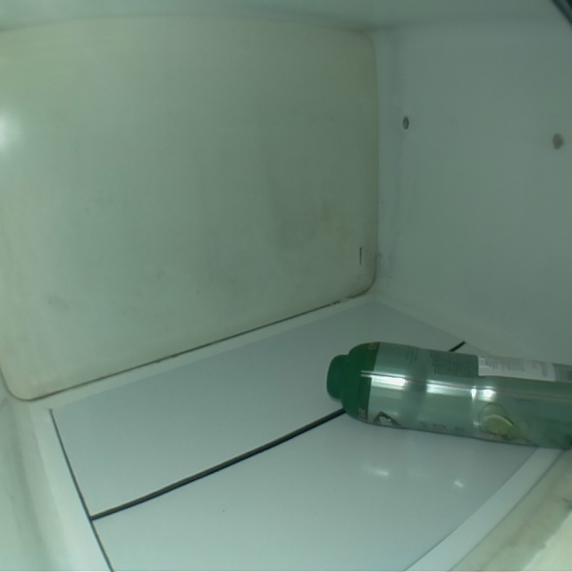
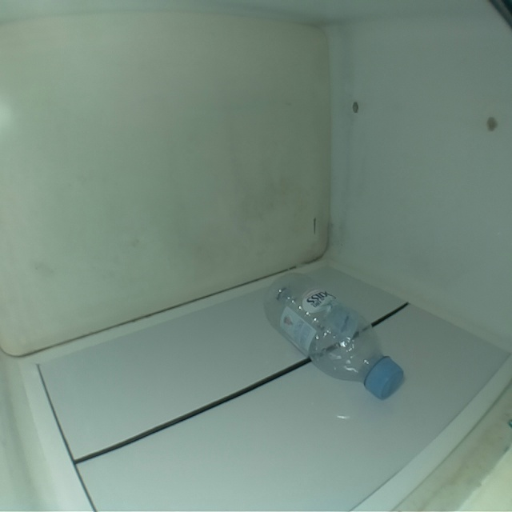
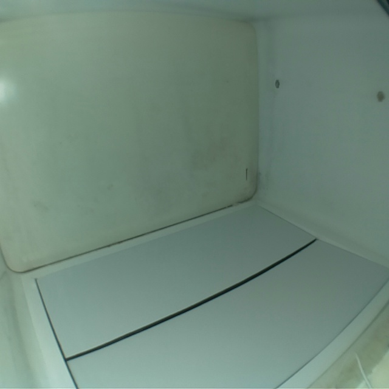

</div>

<br>

### Samples acquired through the RVM environment

A second set of images was collected through the physical prototype.

These samples are particularly valuable because they represent the real **domain of operation** of the machine:

* fixed Raspberry Pi camera position
* machine-specific background
* controlled illumination
* real object orientation
* actual distance from the camera
* mechanical positioning constraints

<div align="center">

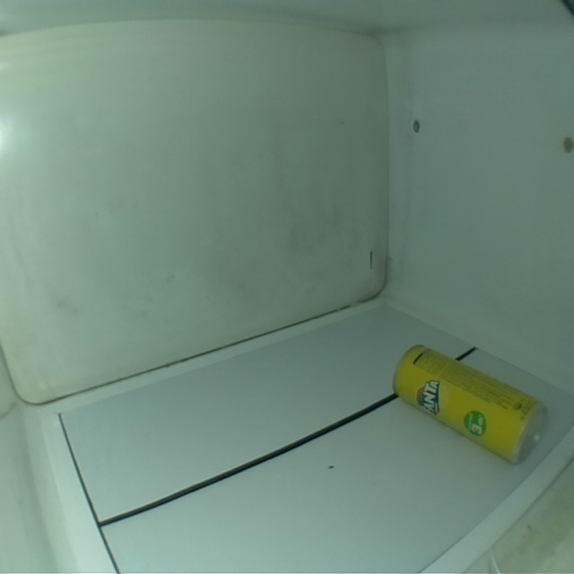
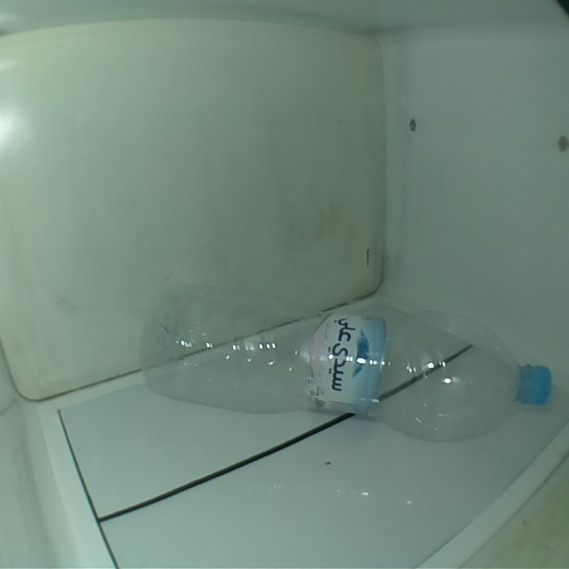
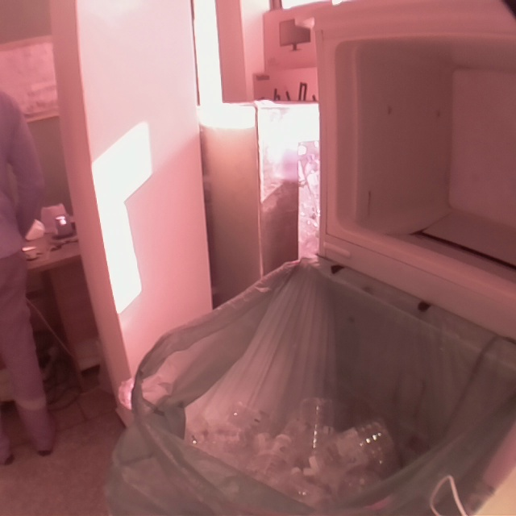

</div>

<br>

Collecting machine-specific samples allowed the model-development process to account for the difference between generic training images and images acquired inside the actual RVM.

---

# 5. Human Machine Interface

The user interaction layer was developed using **Qt Designer and PyQt5**.

Visual elements and interface concepts were prepared using **Canva** and subsequently integrated into the Qt interface.

The HMI was designed as a **touchscreen-oriented interface** rather than a conventional desktop application.

Its role is to guide the user through the complete recycling session while hiding the internal complexity of the embedded system.

## HMI workflow

```text
Start screen
     ↓
Open recycling session
     ↓
Counting / insertion screen
     ↓
Real-time material counters
     ↓
Finish insertion
     ↓
Reward selection
     ↓
QR / Ticket / Donation
```

### Start interface

The start page provides:

* operating instructions
* current date and time
* help access
* language selection
* start-session control

### Counting interface

During insertion, the interface displays:

* number of detected cans
* number of detected plastic containers
* unsupported / unknown objects
* total number of inserted objects
* access to the reward workflow

### Reward interface

At the end of a session, the user can select the desired reward mechanism.

The interface concept includes:

```text
QR Code
Thermal Ticket
Donation
```

### QR interface

The implemented QR workflow generates an encrypted QR code linked to the current recycling session.

The screen also contains:

* session timeout
* refresh control
* finish control
* restart control

---

## UI assets used in the PyQt version

The repository contains the graphical assets used by the redesigned interface.

<div align="center">

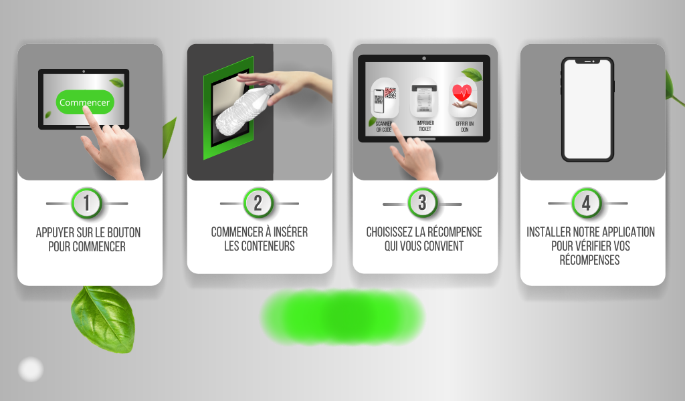
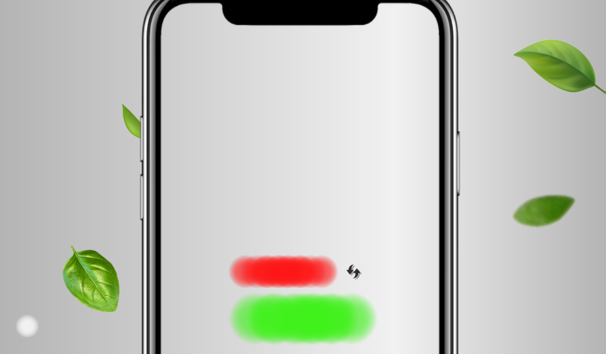

<br><br>

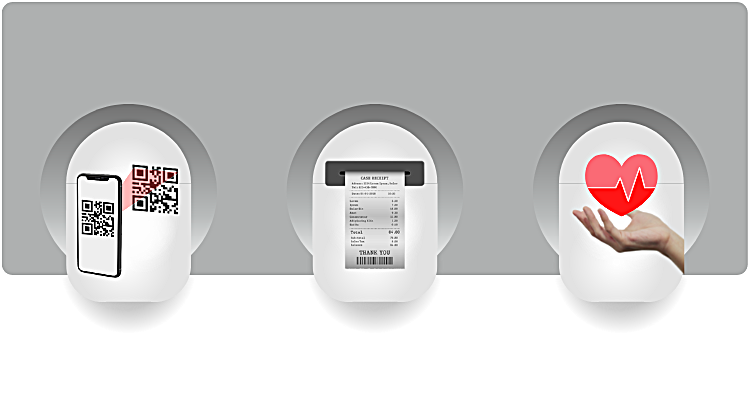
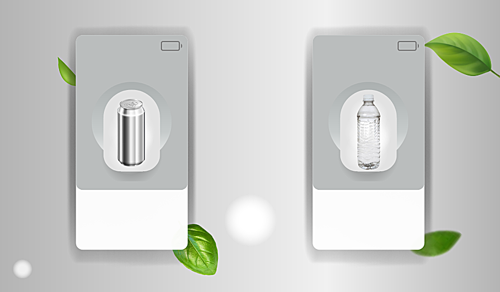

</div>

The interface sources are maintained using Qt Designer files and compiled PyQt resources.

```text
ui_pano.ui
messagebox.ui
res_img.qrc
modules/ui_main.py
modules/messagebox.py
modules/resources.py
```

---

# 6. Hardware Architecture

The project evolved from a Raspberry Pi centered prototype into a more modular **embedded mechatronic architecture**.

## Raspberry Pi 4

The Raspberry Pi acts as the **high-level processing and coordination unit**.

Its responsibilities include:

* camera acquisition
* image preprocessing
* TensorFlow Lite inference
* PyQt5 HMI execution
* session management
* system communication
* image storage
* reward processing
* communication with lower-level control hardware

---

## Raspberry Pi Camera

The camera is installed at the inspection stage of the machine.

Its purpose is to acquire an image once the object reaches a controlled detection position.

```text
Waste
  ↓
Inspection position
  ↓
Camera
  ↓
OpenCV
  ↓
CNN inference
```

---

## Controlled illumination

An LED strip is included around the imaging section to provide more consistent lighting conditions during image capture.

Controlling the acquisition environment reduces one of the major sources of variation in computer-vision systems.

---

## Ultrasonic sensors

The upgraded architecture uses ultrasonic sensing for tasks such as:

* object-presence detection
* object-position monitoring
* conveyor-stage detection
* waste-bin fill-level monitoring

---

## Arduino Nano controllers

The proposed upgraded architecture introduces **multiple Arduino Nano microcontrollers** as lower-level control units.

Their intended responsibilities include:

* reading ultrasonic sensors
* monitoring object positions
* executing deterministic actuator commands
* controlling stepper-motor drivers
* assisting the Raspberry Pi with mechanical routing operations

This creates a separation between:

```text
High-level processing
Raspberry Pi
    ↓
AI + Vision + HMI + Coordination

Low-level control
Arduino Nano
    ↓
Sensors + Motors + Conveyors
```

This architecture reduces the amount of low-level real-time hardware control that must be handled directly by the Raspberry Pi.

---

## Stepper motors and motor drivers

The mechanical subsystem uses stepper motors to drive conveyor and sorting operations.

The upgraded architecture specifies **NEMA 42 stepper motors** together with dedicated motor or microstep drivers.

Their role is to provide controlled mechanical displacement for:

* conveyor transport
* positioning
* sorting
* object routing

---

## Conveyor system

The machine concept contains two main mechanical stages.

### Conveyor 1

Responsible for transporting the inserted object toward the imaging position.

### Conveyor 2 / sorting stage

Responsible for transferring accepted material toward the sorting mechanism.

```text
              CAMERA
                ↓
INPUT → CONVEYOR 1 → INSPECTION
                       ↓
                 CLASSIFICATION
                  /          \
             ACCEPT          REJECT
                ↓               ↓
          CONVEYOR 2       REVERSE C1
                ↓               ↓
          SORTING STAGE       RETURN
```

---

## Thermal printer

A thermal printer was investigated as an alternative reward mechanism.

Its intended role is to generate physical receipts or reward tickets containing information such as:

* recycling transaction
* earned reward
* barcode / redemption information

The repository interface includes the corresponding user option, while the Python callback remains an extension point in the preserved prototype.

---

## Prototype PCB

A PCB concept was also developed using **EasyEDA**.

The goal of this board was to investigate:

* reduction of wiring complexity
* centralized power distribution
* cleaner sensor connections
* more compact electronic integration
* improved internal organization

The PCB remained a prototype design intended for further development.

---

# 7. Complete System Architecture

The upgraded RVM can be represented as a layered embedded system.

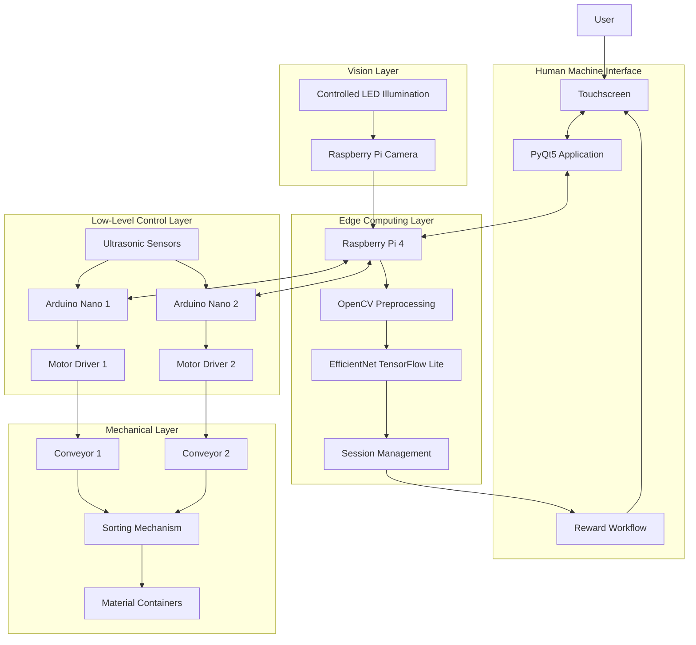

## Functional data flow

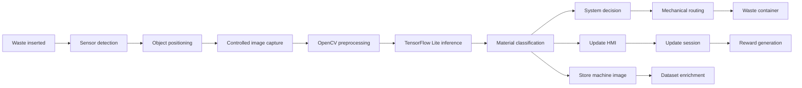

---

# Technology Stack

| Domain                 | Technologies                                 |
| ---------------------- | -------------------------------------------- |
| **Programming**        | Python                                       |
| **Deep Learning**      | TensorFlow, Keras, EfficientNet              |
| **Edge Inference**     | TensorFlow Lite                              |
| **Computer Vision**    | OpenCV, NumPy                                |
| **Embedded Computing** | Raspberry Pi 4                               |
| **Microcontrollers**   | Arduino Nano                                 |
| **HMI**                | PyQt5, Qt Designer                           |
| **UI Design**          | Canva                                        |
| **Hardware Control**   | GPIO, PWM, Stepper Motor Drivers             |
| **Sensors**            | Ultrasonic Sensors                           |
| **Mechanical System**  | Conveyors, Stepper Motors, Sorting Mechanism |
| **Electronics Design** | EasyEDA, PCB prototyping                     |
| **Rewards**            | Encrypted QR Code, Thermal Ticket Concept    |
| **Communication**      | HTTP-based prototype backend                 |
| **Development**        | Python, Google Colab, PyCharm, VNC           |

---

# Engineering Scope

This project combines several engineering disciplines within one prototype:

```text
                Reverse Vending Machine
                         │
       ┌─────────────────┼─────────────────┐
       │                 │                 │
       ▼                 ▼                 ▼
 Artificial          Embedded         Mechatronic
 Intelligence        Systems            Design
       │                 │                 │
       ▼                 ▼                 ▼
 EfficientNet       Raspberry Pi        Sensors
 TensorFlow         Arduino Nano         Motors
 OpenCV             GPIO                Conveyors
 TFLite             HMI                 Sorting
       │                 │                 │
       └─────────────────┼─────────────────┘
                         ▼
                Integrated Edge AI
                 Recycling System
```

The primary engineering value of the project is therefore not limited to training an image classifier or creating a graphical interface.

It demonstrates the integration of **machine learning, embedded deployment, physical sensing, electromechanical control, data acquisition, user interaction, and system architecture** into a single intelligent recycling-machine concept.

---

# Repository Structure

```text
RVM-finale/
│
├── assets/
│   └── project2.png
│
├── developement/
│
│   ├── backup_iosen/
│   │   ├── dataset/
│   │   │   └── images/
│   │   │       ├── Metal/
│   │   │       ├── Plastic/
│   │   │       ├── Other/
│   │   │       ├── adminGlass/
│   │   │       ├── adminMetal/
│   │   │       ├── adminOther/
│   │   │       └── adminPlastic/
│   │   │
│   │   └── model/
│   │       ├── my_modelv2b0.tflite
│   │       └── my_modelv2b0_bkp.tflite
│   │
│   └── raspberry/
│       ├── main.py
│       ├── raspberry_main.py
│       ├── motor.py
│       ├── ui_pano.ui
│       ├── messagebox.ui
│       ├── res_img.qrc
│       ├── modules/
│       └── images/
│
└── README.md
```

---

# Project Status

This repository preserves the development state of a **2022 graduation engineering prototype**.

The first RVM generation was used to validate the core embedded computer-vision concept. The second generation represents an engineering redesign intended to improve the machine's **mechanical architecture, distributed hardware control, sensing, maintainability, and user experience**.

Future modernization work can include:

* hardware abstraction between Raspberry Pi and Arduino controllers
* complete class-to-actuator routing implementation
* reproducible model-training notebooks
* confusion matrix and per-class evaluation
* Raspberry Pi inference-latency measurements
* secure configuration management
* HTTPS backend communication
* automated software testing
* improved PCB integration
* complete thermal-printer implementation
* deployment of the upgraded mechanical architecture


